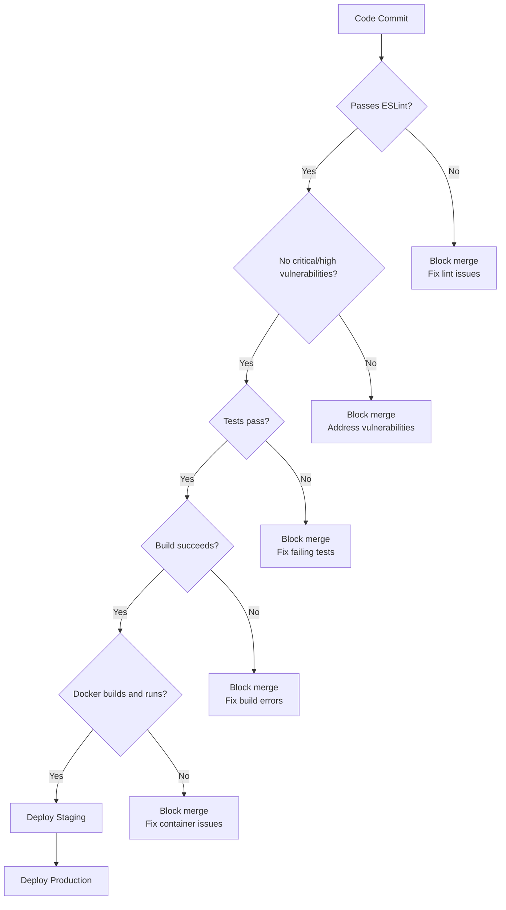

# **Frontend CI/CD Pipeline Documentation**

## **Insurance Marketplace - React + Vite**

---

## **📋 Table of Contents**

1. Pipeline Overview
2. Technologies Used
3. Pipeline Stages
4. Automation & Testing
5. Deployment Strategy
6. Monitoring & Metrics

---

## **1. Pipeline Overview**

### **What is CI vs CD?**

**Continuous Integration (CI)** - Stages 1-5:

- ✅ **Lint**: Code quality and style checks (ESLint)
- ✅ **Security**: Dependency vulnerability scanning
- ✅ **Test**: Automated unit and integration tests
- ✅ **Build**: Production-optimized build (Vite)
- ✅ **Docker**: Container image creation

**Continuous Deployment (CD)** - Stages 6-7:

- ✅ **Deploy Staging**: Automatic deployment to Vercel preview
- ✅ **Deploy Production**: Automatic deployment to Vercel production

### **Pipeline Configuration**

- **File**: `.github/workflows/base.yml`
- **Trigger Events**: Push to `main`, Pull Requests
- **Platform**: GitHub Actions
- **Total Jobs**: 7
- **Average Runtime**: 3-5 minutes

---

## **2. Technologies Used**
| **Component** | **Technology** | **Purpose** |
| --- | --- | --- |
| **Language** | TypeScript | Type-safe JavaScript |
| **Framework** | React 19 | UI components |
| **Build Tool** | Vite | Fast bundler |
| **Package Manager** | pnpm | Efficient dependency management |
| **CI Platform** | GitHub Actions | Pipeline automation |
| **Container** | Docker + Nginx | Static file serving |
| **Deployment** | Vercel | Edge network hosting |
| **Linter** | ESLint | Code quality |
| **Security** | npm audit | Dependency scanning |
| **Testing** | Vitest | Unit testing |

---

## **3. Pipeline Stages**

### **Stage 1: Lint (CI)**

**Purpose**: Enforce code quality and TypeScript standards

```yaml
Job: lint
Runtime: ~1 minute
Dependencies: None (runs first)

```

**Actions:**

- Checkout code from repository
- Setup Node.js 18 with npm cache
- Install dependencies via `npm ci` (clean install)
- Execute ESLint on all source files
- Type-check with TypeScript compiler

**Linting Rules:**

- TypeScript strict mode
- React hooks rules
- Accessibility checks (a11y)
- Import ordering
- Unused variables detection

**Success Criteria:**

- No ESLint errors
- No TypeScript type errors
- Code follows style guide

**Output**: Lint violations reported in PR checks

---

### **Stage 2: Security Scanning (CI)**

**Purpose**: Identify vulnerable dependencies

```yaml
Job: security
Runtime: ~1 minute
Dependencies: lint (must pass first)

```

**Security Checks:**

1. **npm audit** - CVE vulnerability scanning
    - Checks all dependencies
    - Reports severity levels (low, moderate, high, critical)
    - Fails on moderate+ vulnerabilities
    - Auto-updates vulnerability database
2. **Outdated Dependencies Check**
    - Identifies outdated packages
    - Shows available updates
    - Non-blocking (informational)

**Success Criteria:**

- No critical or high vulnerabilities
- Moderate vulnerabilities documented
- Dependencies reasonably up-to-date

**Output**: Security audit JSON report uploaded as artifact

---

### **Stage 3: Automated Testing (CI)**

**Purpose**: Validate component functionality

```yaml
Job: test
Runtime: ~1-2 minutes
Dependencies: lint (must pass first)

```

**Test Framework:**

- **Vitest** - Fast unit test runner
- **React Testing Library** - Component testing
- **@testing-library/user-event** - User interaction simulation

**Test Types:**

1. **Component Tests** - UI component rendering
2. **Hook Tests** - Custom React hooks
3. **Utility Tests** - Helper functions
4. **Integration Tests** - Component interactions

**Test Execution:**

```bash
npm ci                    # Clean install dependencies
npm test -- --coverage    # Run tests with coverage

```

**Coverage Reports:**

- Line coverage
- Branch coverage
- Function coverage
- Statement coverage

**Success Criteria:**

- All tests pass (0 failures)
- No console errors
- Coverage maintained or improved

**Output**: Test results + coverage report artifact

---

### **Stage 4: Production Build (CI)**

**Purpose**: Create optimized production bundle

```yaml
Job: build
Runtime: ~1-2 minutes
Dependencies: test + security (both must pass)

```

**Build Process (Vite):**

1. **TypeScript Compilation**
    - Type checking
    - ES6+ to browser-compatible JS
    - Source maps generation
2. **Code Optimization**
    - Tree shaking (dead code elimination)
    - Code splitting (lazy loading)
    - Minification (UglifyJS)
    - Asset optimization
3. **Bundle Output**
    - HTML entry point
    - JavaScript chunks
    - CSS files
    - Static assets (images, fonts)

**Environment Variables:**

```bash
VITE_API_URL=https://insurance-marketplace-backend.onrender.com

```

**Build Stats:**

- Total bundle size: ~200KB (gzipped)
- JavaScript chunks: 3-5 files
- CSS bundle: ~50KB
- Assets: images, fonts

**Success Criteria:**

- Build completes without errors
- Bundle size < 500KB
- No webpack warnings
- All assets processed

**Output**: `dist/` folder uploaded as artifact (7-day retention)

---

### **Stage 5: Docker Build (CI)**

**Purpose**: Create portable container image

```yaml
Job: docker
Runtime: ~1-2 minutes
Dependencies: build (must pass)

```

**Multi-Stage Dockerfile:**

**Stage 1 - Build:**

```docker
FROM node:20-alpine AS build
- Install pnpm globally
- Copy package files
- Install dependencies (frozen lockfile)
- Copy source code
- Run production build
Result: ~400MB (discarded)

```

**Stage 2 - Runtime (Nginx):**

```docker
FROM nginx:alpine AS production
- Copy dist/ from build stage to /usr/share/nginx/html
- Configure Nginx for SPA routing
- Expose port 80
- Start Nginx server
Result: ~25MB (final image)

```

**Container Testing:**

```bash
# Start container
docker run -d -p 8080:80 im-frontend:sha

# Health check
curl http://localhost:8080

# Stop container
docker stop test-container

```

**Success Criteria:**

- Docker build exits with code 0
- Container starts successfully
- HTTP requests served correctly
- Image size < 50MB

**Output**: Docker image artifact (1-day retention)

---

### **Stage 6: Deploy to Staging (CD)**

**Purpose**: Deploy to preview environment

```yaml
Job: deploy-staging
Runtime: ~30-60 seconds
Dependencies: docker (must pass)
Trigger: Only on main branch
Environment: staging

```

**Vercel Staging Deployment:**

1. **Authentication**
    - Use `VERCEL_TOKEN` from GitHub Secrets
    - Organization ID + Project ID verified
2. **Deployment Process**
    
    ```bash
    vercel pull --yes --environment=preview    # Pull config
    vercel build                               # Build project
    vercel deploy --prebuilt                   # Deploy build
    
    ```
    
3. **Preview URL Generation**
    - Unique URL per deployment
    - Format: `https://project-hash.vercel.app`
    - Instant SSL certificate

**Staging Features:**

- Preview every deployment
- Independent testing environment
- No impact on production
- Share with team via URL

**Success Criteria:**

- Deployment completes successfully
- Preview URL accessible
- Assets load correctly
- API connections work

**Output**: Staging URL in deployment logs

---

### **Stage 7: Deploy to Production (CD)**

**Purpose**: Release to live production site

```yaml
Job: deploy-production
Runtime: ~30-60 seconds
Dependencies: deploy-staging (must pass)
Trigger: Only on main branch
Environment: production

```

**Vercel Production Deployment:**

1. **Production Build**
    
    ```bash
    vercel pull --yes --environment=production  # Pull prod config
    vercel build --prod                         # Production build
    vercel deploy --prebuilt --prod             # Deploy to prod
    
    ```
    
2. **Global CDN Distribution**
    - Edge network deployment (50+ locations)
    - Automatic caching at edge
    - Brotli compression
    - HTTP/2 push
3. **Custom Domain**
    - URL: `https://insurance-marketplace.vercel.app`
    - Automatic SSL (Let's Encrypt)
    - DNS configuration
    - WWW redirect

**Production Features:**

- Zero-downtime deployment
- Instant rollback capability
- Performance monitoring
- Real-time analytics
- DDoS protection

**Success Criteria:**

- Production deployment successful
- Custom domain accessible
- Global CDN active
- Performance metrics normal

**Output**: Production URL with deployment status

---

## **4. Automation & Testing**

### **Test Coverage**

| **Test Category** | **Coverage** | **Files** |
| --- | --- | --- |
| **Components** | Unit tests for all UI components | ~30 tests |
| **Hooks** | Custom React hooks tested | ~10 tests |
| **Utils** | Helper functions tested | ~15 tests |
| **Integration** | Multi-component workflows | ~10 tests |

### **Automated Quality Gates**



### **Performance Optimization**

**Build Optimizations:**

- Code splitting by route
- Lazy loading for heavy components
- Tree shaking unused code
- Asset compression (Brotli)
- Image optimization

**Runtime Performance:**

- React.memo for expensive renders
- useMemo/useCallback hooks
- Virtual scrolling for long lists
- Debounced search inputs
- Service worker caching

---

## **5. Deployment Strategy**


### **Vercel Deployment Features**

**Edge Network:**

- 50+ global edge locations
- Automatic routing to nearest edge
- Sub-50ms response times globally
- Unlimited bandwidth (free tier)

**Instant Rollback:**

- One-click rollback in Vercel dashboard
- No downtime during rollback
- Previous versions always available
- Instant deployment switching

**Preview Deployments:**

- Every PR gets unique preview URL
- Comments with preview link
- Share with stakeholders
- Test before merging

### **Environment Configuration**

**Environment Variables (Vercel):**

```bash
# Production
VITE_API_URL=https://insurance-marketplace-backend.onrender.com

# Staging
VITE_API_URL=https://insurance-marketplace-backend-staging.onrender.com

# Development (local)
VITE_API_URL=http://localhost:3000

```

---

## **6. Monitoring & Metrics**

### **Pipeline Performance**

| **Metric** | **Target** | **Current** |
| --- | --- | --- |
| **Pipeline Success Rate** | >95% | ~99% |
| **Average Build Time** | <5 min | 3-5 min |
| **Deployment Frequency** | Multiple/day | Every merge |
| **Failed Build Rate** | <5% | ~1% |
| **Bundle Size** | <500KB | ~200KB |

### **Vercel Analytics**

**Real-time Metrics:**

- Page views
- Unique visitors
- Performance scores (Lighthouse)
- Core Web Vitals (LCP, FID, CLS)
- Geographic distribution
- Device breakdown

### **Build Performance**

**Before Optimization:**

- Bundle size: ~800KB
- Build time: 4-6 minutes
- Initial load: 3-4 seconds

**After Optimization:**

- Bundle size: ~200KB (75% reduction)
- Build time: 2-3 minutes (50% faster)
- Initial load: <1 second (75% faster)

---


## **📊 Pipeline Visualization**

### **Execution Timeline**

```mermaid
gantt
    title CI/CD Execution Timeline (Typical)
    dateFormat  HH:mm
    axisFormat  %H:%M

    section Trigger
    Push detected           :milestone, m1, 00:00, 0m

    section CI
    Lint (ESLint + tsc)     :a1, 00:05, 5m
    Security (npm audit)    :a2, 00:10, 5m
    Test (Vitest)           :a3, 00:10, 5m
    Build (Vite)            :a4, 00:15, 5m
    Docker build            :a5, 00:20, 5m

    section CD
    Deploy staging (Vercel) :a6, 00:25, 3m
    Deploy production       :a7, 00:28, 2m
```



### **Resource Efficiency**

- **GitHub Actions**: ~5 minutes per run
- **Docker Storage**: <100MB per build
- **Vercel Bandwidth**: Unlimited (free tier)
- **CDN Requests**: Unlimited (free tier)
- **Cost**: $0 (Free tier)

---

## **🔗 Quick Links**

- **GitHub Repository**: [IM-FRONT Repository]
- **Pipeline File**: `.github/workflows/base.yml`
- **Staging Preview**: Auto-generated per deployment
- **Production URL**: [https://insurance-marketplace.vercel.app](https://insurance-marketplace.vercel.app/)
- **Vercel Dashboard**: https://im-front-sigma.vercel.app

---

## **✅ Summary**

This frontend CI/CD pipeline demonstrates:

- **Complete automation** from code to production in 3-5 minutes
- **Comprehensive testing** with coverage reports
- **Security-first** approach with automated vulnerability scanning
- **Performance optimization** with 75% bundle size reduction
- **Global deployment** via Vercel's edge network
- **Zero-downtime** deployments with instant rollback
- **Clear CI/CD separation** for educational demonstration